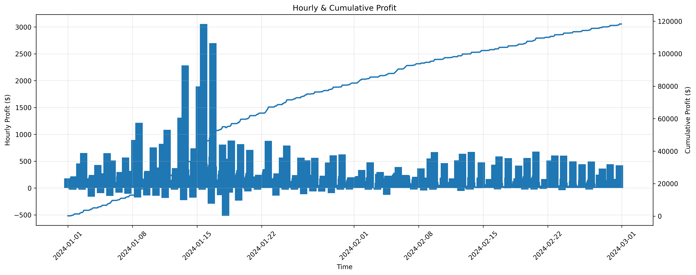
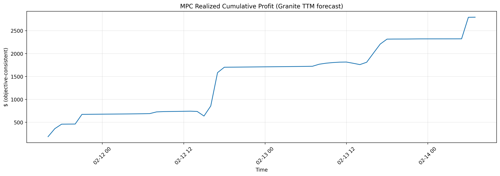

# NRG Market - Energy Market Prediction & Optimization

AI-powered energy market optimization platform for maximizing revenue through intelligent arbitrage and predictive analytics.

## 🚀 Features

- **Market Analytics**: Real-time energy market data visualization and analysis
- **Price Forecasting**: AI-powered price prediction (IBM Granite TTM, inference-only)
- **Optimization Engine**: co-optimization for energy + ancillary services with battery constraints
- **Data Upload**: Custom data integration for personalized analysis
- **Interactive Dashboard**: Modern, responsive UI with real-time charts

## 🏗️ Project Structure

```
energy-market-prediction/
├── frontend/               # React + Vite frontend application
│   ├── src/
│   │   ├── components/    # React components
│   │   └── main.jsx       # Application entry point
│   ├── public/            # Static assets
│   │   └── img/           # README + UI demo images (add)
│   │       ├── hourly_Cum_Profit.png
│   │       ├── battery_soc.png
│   │       ├── mpc_cum_profit.png
│   │       ├── net_energy_flow.png
│   │       └── Buy_Sell_per_Product.png
│   └── package.json
│
└── backend/               # Node.js + Python backend
    ├── src/               # Node.js API server
    │   ├── app.js
    │   ├── server.js
    │   ├── controllers/
    │   ├── middlewares/
    │   ├── routes/
    │   ├── services/
    │   └── utils/
    │
    └── python/            # Python optimization & forecasting
        ├── Cooptimization.py
        ├── params.py
        ├── pull_prices.py
        ├── forecasting/
        │   ├── __init__.py
        │   └── granite_ttm_forecaster.py
        ├── data/
        ├── optimization_results/
        └── scripts/
            ├── __init__.py
            ├── plot.py
            ├── run_mpc_granite.py
            └── run_granite_forecast_and_optimize.py

```

## 🛠️ Technology Stack

### Frontend
- **React** - UI framework
- **Vite** - Build tool and dev server
- **TailwindCSS** - Utility-first CSS framework
- **Chart.js** - Data visualization
- **Lucide React** - Icon library

### Backend
- **Node.js** - API server
- **Express.js** - Web framework
- **Python for optimization + forecasting**
  - IBM Granite TTM (inference-only forecasting)
  - Rolling MPC dispatch (forecast → optimize → execute 1-step → repeat)
  - MILP co-optimization (energy + ancillary + degradation constraints)

## 📦 Installation

### Prerequisites
- Node.js (v16 or higher)
- Python (v3.8 or higher)
- npm or yarn

### Frontend Setup

```bash
cd frontend
npm install
npm run dev
```

The frontend will be available at `http://localhost:5173`

### Backend Setup

#### Node.js Server
```bash
cd backend
npm install
npm start
```

#### Python Environment
```bash
cd backend/python
pip install -r requirements.txt
```
#### Forecasting requirements
```bash
cd backend/python
pip install -r requirements_forecast.txt
```

## 🚀 Usage

1. **Start the Backend Server**
   ```bash
   cd backend
   npm start
   ```

2. **Start the Frontend Development Server**
   ```bash
   cd frontend
   npm run dev
   ```

3. **Navigate to the Application**
   - Open your browser to `http://localhost:5173`
   - Explore the home page, analytics dashboard, and data upload features
  
## Input CSV Schema (required)
Upload (or place under `backend/python/data/`) a merged prices CSV with columns:
- `datetime` (hourly timestamps)
- `SP15`
- `RegUp`
- `RegDown`
- `Spin`
- `NonSpin`
Example filename:
- `backend/python/data/merged_prices_snapshot.csv`
---
## Run Modes
The app supports two modes that the frontend can expose as a toggle:
- Mode A: Baseline (Offline Co-Optimization)
- Mode B: AI Forecast + Rolling MPC (Granite)
Difference:
- Baseline uses the full window of actual prices (perfect-foresight benchmark)
- MPC is deployable-style: forecast next H hours, optimize, execute first hour, repeat, score realized P&L
---
## Mode A: Baseline (Offline Co-Optimization)
Run from `backend/python`:
```bash
python Cooptimization.py
```
Outputs are written under:
```
backend/python/optimization_results/<run_id>/
```
Plot-ready CSVs produced by the export step (baseline):
```
plot_prices_window.csv
columns: datetime, SP15, NonSpin, RegDown, RegUp, Spin
plot_energy_actions.csv
columns: datetime, buy_qty, sell_qty, pnl, solar_to_grid, solar_to_batt, solar_curtail, net_mwh
plot_soc.csv
columns: datetime, soc_asset_1
plot_reserve_commitments.csv
columns: datetime, NonSpin, RegDown, RegUp, Spin
```
Recommended baseline images to show in UI/demo:
- `hourly_Cum_Profit.png` (offline optimal benchmark P&L; hourly bars + cumulative line)
- `battery_soc.png` (constraint credibility; SoC stays within bounds)


---
## Mode B: AI Forecast + Rolling MPC (Granite TTM inference-only)
This mode simulates realistic operation under uncertainty:
For each hour t:
1. forecast next H hours of prices (Granite)
2. solve co-optimization over horizon H
3. execute only the first-hour action
4. compute realized profit using actual prices at hour t
5. update battery SoC and repeat
Run from `backend/python`:
```bash
python -m scripts.run_mpc_granite \
  --start-index 1000 --end-index 1100 --horizon 42 \
  --blend --clip --as-discount 0.6 \
  --anchor-first-hour --log-components --export
```
Flags:
- `--horizon`: forecast + optimization horizon (hours)
- `--blend`: blend Granite forecast with a lag-24 baseline to stabilize
- `--clip`: clip extreme forecast outliers to recent plausible bounds
- `--as-discount`: conservative scaling for ancillary forecasts (reduces over-commitment risk)
- `--anchor-first-hour`: first horizon step uses known current-hour price (realistic ops)
- `--log-components`: prints energy vs ancillary vs degradation P&L components
- `--export`: write outputs (CSVs + plots) under `optimization_results/`
MPC outputs folder example:
```
backend/python/optimization_results/mpc_granite_1000_1100_H42/
```
Key artifacts (MPC):
```
mpc_realized_pnl.csv
columns: datetime, profit_realized, profit_cum, soc_asset_1
forecast_report_1step.csv
columns: series, mape_1step, mae_1step, smape_1step, dir_acc_%, top5_hit_%
blend_alpha.csv (if --blend)
columns: series, alpha
mpc_cum_profit.png (if plots enabled/exported)
```
Recommended MPC image to show in UI/demo:
- `mpc_cum_profit.png` (realized profit curve under uncertainty; forecast-driven dispatch)

---
## Metrics (what to show judges)
Forecast metrics are reported per series in:
```
backend/python/optimization_results/<mpc_run>/forecast_report_1step.csv
```
Fields:
- `mae_1step`: absolute error (stable in $ units)
- `smape_1step`: symmetric percent error (more stable than MAPE near zero)
- `mape_1step`: can inflate when actual values are near 0 (common for ancillary)
- `dir_acc_%`: directional accuracy (up/down movement correctness)
- `top5_hit_%`: peak-hour hit rate (captures best arbitrage hours)
Recommended judge framing:
- **Baseline (offline)**: benchmark / upper bound (validates constraints + value potential)
- **MPC (Granite)**: deployable pipeline (forecast → optimize → execute-first-step) with realized P&L curve
---
## Notes / Troubleshooting
- If imports fail (`ModuleNotFoundError`), run from `backend/python` root or use module execution:
```bash
  cd backend/python
  python -m scripts.run_mpc_granite ...
```
- If ancillary MAPE looks very large:
  Ancillary prices can be near 0, which makes MAPE unstable. Prefer MAE/sMAPE and decision metrics (dir_acc, top5_hit).
---

## 📊 Features Overview

### Analytics Dashboard
- Real-time market price visualization
- Historical trend analysis
- Predictive forecasting charts
- Performance metrics

### Data Upload
- Custom CSV/Excel file upload
- Data validation and preprocessing
- Integration with optimization models

### Optimization Engine
- Co-optimization algorithms ([Cooptimization.py](backend/python/Cooptimization.py))
- Parameter configuration ([params.py](backend/python/params.py))
- Market price integration ([pull_prices.py](backend/python/pull_prices.py))

## 🔧 Configuration

### Frontend Configuration
- Vite config: [vite.config.js](frontend/vite.config.js)
- Tailwind config: [tailwind.config.js](frontend/tailwind.config.js)
- ESLint config: [eslint.config.js](frontend/eslint.config.js)

### Backend Configuration
- Server settings in [src/server.js](backend/src/server.js)
- Python parameters in [python/params.py](backend/python/params.py)

## 🤝 Contributing

 Contributions, issues, and feature requests are welcome!

## 📄 License

This project is open source and available under the MIT License.
